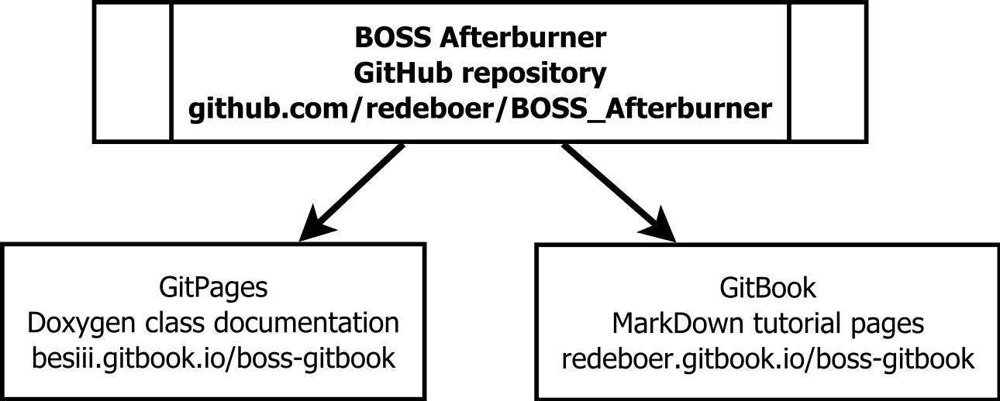

# Main page


**This repository is still under development!**


## The BOSS Afterburner repository

This repository has been set up as an unofficial extension to the BOSS analysis framework of the [BESIII collaboration](http://bes3.ihep.ac.cn), with two related purposes:

1. Serve as an accessible introduction and user guide to **BOSS**.
2. Provide basic tools to analyse and visualise output of **BOSS**.

If you do not have an IHEP networking account, it is therefore better to check out the official [Offline Software page](http://english.ihep.cas.cn/bes/doc/2247.html) of BESIII — this framework can only be of use if you are a collaborator of this experiment and if you have access to the software of this collaboration. You can also have a look at the section [Further reading](appendices/references.md).

The BOSS Afterburner repository can be accessed through three channels. There is:

1. [the repository itself on GitHub](https://github.com/redeboer/BOSS_Afterburner), containing all the source code, including MarkDown files;
2. [the BOSS GitBook](https://redeboer.gitbook.io/boss-gitbook), which contains tutorial-like pages on both the BOSS Analysis Framework and the BOSS Afterburner;
3. [Doxygen documentation of the BOSS Afterburner](https://redeboer.github.io/BOSS_Afterburner/). This page can be consulted for more details about the code in the BOSS Afterburner.

## Tutorial pages

The documentation of the [GitBook page](https://besiii.gitbook.io/boss-gitbook) is intended to provide tutorials for using both the BOSS Analysis Framework and the BOSS Afterburner. If you are not familiar with BOSS, it is best to start looking at that part of the tutorial.



However, parts of this tutorial refer to components of the BOSS Afterburner repository. Keep that repository therefore at hand \(by cloning it\).

If you have been able to create data output, you can analyse your results with the BOSS Afterburner. This is described in the second part of this GitBook.

Finally, I have written out any problems and solutions or handy tricks into the [Tips & Tricks](appendices/tips.md) section. Other additional sections, like [Further reading](appendices/references.md), have also been collected into the appendices.

